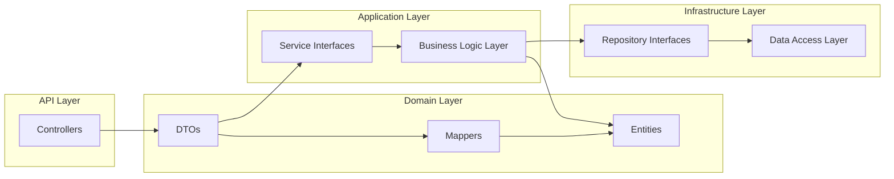

# 🧠 SaaS-Based Customer Relationship Management (CRM)

A modular monolith backend system for managing customer relationships, built with **Java**, **Spring Boot**, and **Clean Architecture** principles. Designed to support scalable CRM features like contact management, sales tracking, and service integration.

---

## 🧱 Project Structure

```
src/main/java/com/SaaS_Based_Customer_Relationship_Management/CRM/
├── Application.java                      ← Spring Boot entry point
├── business_logic_layer/                ← Core business rules
├── controllers/                         ← REST API endpoints
├── data_access_layer/                   ← JPA repositories
├── dtos/                                ← Data Transfer Objects
├── entities/                            ← Domain entities
├── exceptions/                          ← Custom exception handling
├── mappers/                             ← MapStruct DTO ↔ Entity mappers
├── repositories/                        ← Persistence interfaces
├── service_provider_interface/          ← Service contracts
└── valadations_utils/                   ← Input validation utilities
```

> 🧼 Follows **Clean Architecture** with layered separation of concerns for maintainability and testability.

---

## 🔍 Module Breakdown

| Folder                     | Description                                                                 |
|---------------------------|-----------------------------------------------------------------------------|
| `Application.java`         | Main class to bootstrap the Spring Boot application                        |
| `business_logic_layer`     | Implements core logic for CRM operations like contact and sales workflows  |
| `controllers`              | Exposes RESTful endpoints for client interaction                           |
| `data_access_layer`        | Contains JPA repositories for database access                              |
| `dtos`                     | Defines request/response models for API communication                      |
| `entities`                 | Represents domain models mapped to DB tables                               |
| `exceptions`               | Custom exceptions and global error handling                                |
| `mappers`                  | Uses MapStruct to convert between DTOs and entities                        |
| `repositories`             | Interfaces for data access abstraction                                     |
| `service_provider_interface`| Declares service interfaces for business logic                            |
| `valadations_utils`        | Utility classes for validating incoming data                               |

---

## 🧬 Architecture Overview



> 🧩 Designed for extensibility — future modules like notification, analytics, or multi-tenancy can be added seamlessly.

---

## 🚀 Getting Started

```bash
# 1️⃣ Clone the repository
git clone https://github.com/Shubh00796/SaaS_Based_Customer_Relationship_Management.git
cd SaaS_Based_Customer_Relationship_Management

# 2️⃣ Open in your favorite IDE (IntelliJ, VS Code)

# 3️⃣ Run the application
# Make sure MySQL/PostgreSQL is running and configured in application.yml
mvn spring-boot:run
```

---

## 🐳 Docker (Coming Soon)

Docker support is planned for future releases to enable:

- Containerized deployment
- Environment consistency
- Easy onboarding for contributors

Stay tuned for updates!

---

## 📚 References

- 📘 [Spring Boot Documentation](https://docs.spring.io/spring-boot/docs/current/reference/html/)
- 📘 [MapStruct – Java Bean Mapping](https://mapstruct.org/)
- 📘 [Clean Architecture – Uncle Bob](https://8thlight.com/blog/uncle-bob/2012/08/13/the-clean-architecture.html)

---

## 🤝 Contributing

We welcome your ideas and PRs! 🚀

```bash
# Fork + branch
git checkout -b feature/my-feature

# Commit & push changes
git commit -m "Add feature"
git push origin feature/my-feature

# Open a pull request
```

For major changes, open an issue first to discuss your proposal.

---

## 🙌 Support & Feedback

Found this useful?  
⭐ Star the repo or open an issue with suggestions.

---
